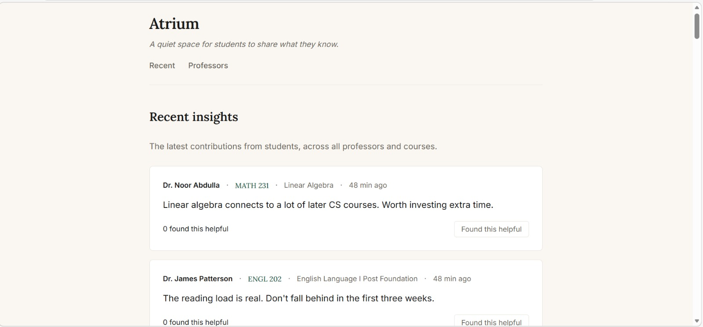
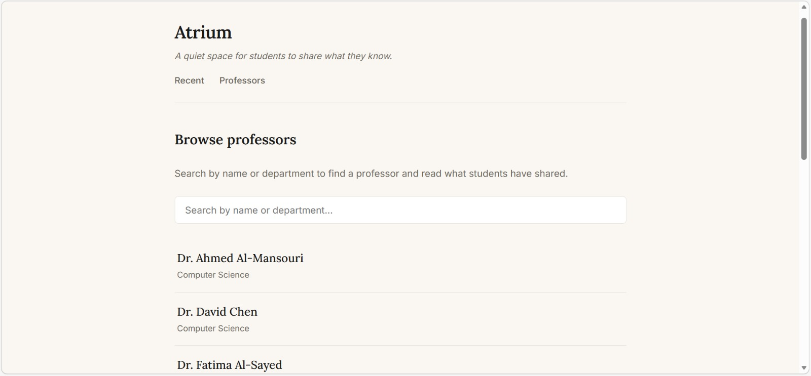
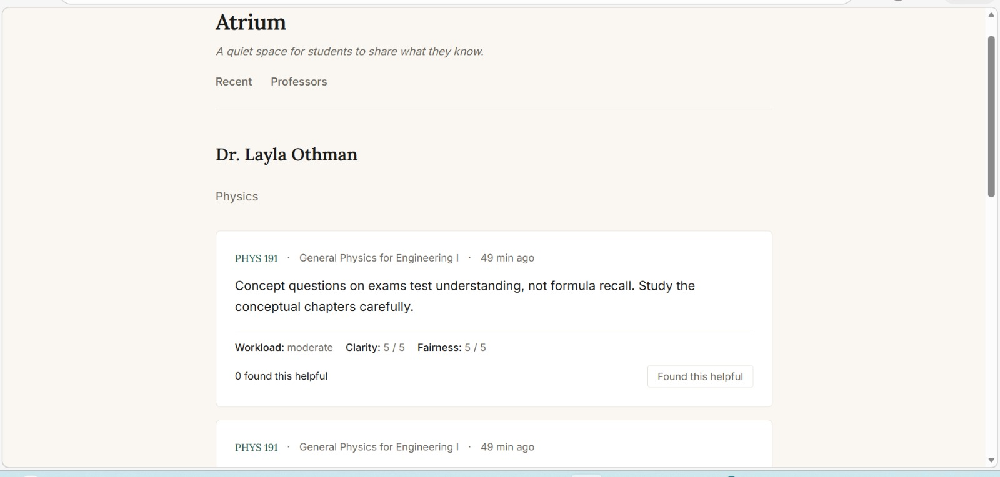
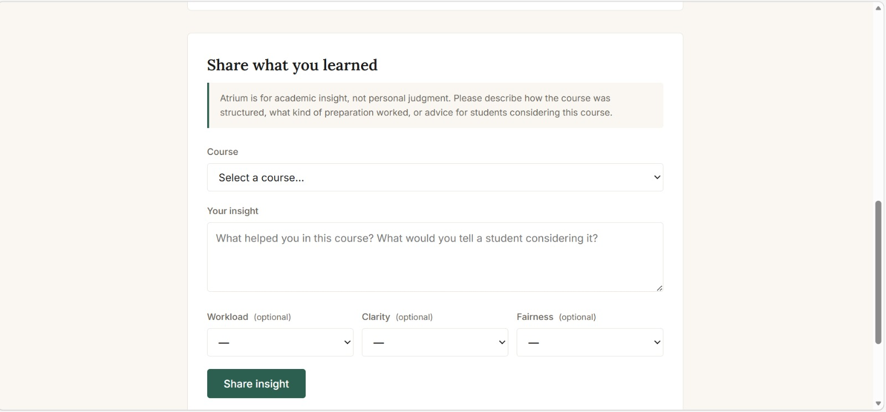

# Atrium

[](https://github.com/AbdelrahmanPro-grammer/atrium/actions/workflows/ci.yml)

> A quiet space for students to share what they know.

Atrium is a private, university-focused platform where students share academic insight to help peers register for courses with confidence. It is built around a single conviction: course registration is one of the most consequential decisions students make each semester, and most of us make it with almost no real information.

-----



-----

## The problem

Every semester, students choose courses with very little real information about who is teaching them. Conversations that would help — *“how does this professor structure exams?”*, *“how much reading is realistic per week?”*, *“what kind of preparation actually worked?”* — happen in scattered WhatsApp threads and disappear within hours.

Atrium gives that knowledge a structured, persistent place to live. The goal is not to rate professors. The goal is to help students prepare.

## What this is (and isn’t)

Atrium is for **academic insight, not personal judgment**.

Helpful contributions describe how a course was structured, what kind of preparation worked, what surprised the contributor, and advice for students considering the course. Personal commentary, unsubstantiated claims, and content unrelated to the academic experience are not welcome — and the form is designed to gently steer toward useful input rather than reactionary venting.

This shapes everything in the project: the calm visual identity, the language used in the UI (“share what you learned” rather than “rate this professor”), the structured optional ratings (workload, clarity, fairness — describing the *course*, not the *person*), and the moderation policy in the roadmap below.

## Status

This repository is **v0.1 — a working technical core**. It is intended as both a demonstration of full-stack engineering and the foundation for a 90-day execution plan toward a real launch.

What’s built:

- A REST API backed by SQLite, with seven endpoints
- A minimal, responsive frontend (three pages, vanilla JavaScript, no build step)
- A seed script with realistic fictional data for development and demos
- A pytest test suite covering the data access layer
- Continuous integration via GitHub Actions running on every push

What is intentionally not yet built — see the roadmap below.

## Screenshots

**Browse professors** — search by name or department, filtered live as you type.



**Single professor view** — read past insights, contribute your own with a low-friction form.

 




## Tech stack

|Layer   |Technology                     |Why                                                                                                                                                                           |
|--------|-------------------------------|------------------------------------------------------------------------------------------------------------------------------------------------------------------------------|
|Database|SQLite                         |Single-user v0.1, zero setup, file-based. Easily migratable to PostgreSQL when authentication is added.                                                                       |
|Backend |Python + Flask                 |Lightweight, transparent, well-suited to a small REST API. No ORM — raw SQL kept in `schema.sql` and parameterized queries in `db.py` for clarity.                            |
|Frontend|HTML + CSS + vanilla JavaScript|No framework, no build step. The product is small enough that a framework would add weight without earning it, and the constraint of working in plain JS deepens fundamentals.|
|Testing |pytest                         |Standard Python testing framework. Tests focus on the data access layer, where logic bugs would propagate hardest.                                                            |
|CI      |GitHub Actions                 |Every push runs the full test suite on a clean Ubuntu container.                                                                                                              |

## Architecture

The project follows a clear separation of concerns:

```
schema.sql          ← The single source of truth for the database structure
    │
    ▼
backend/db.py       ← The data access layer. Every SQL query in the project lives here.
    │
    ▼
backend/app.py      ← The Flask API. Routes do validation and delegate to db.py.
    │
    ▼
frontend/app.js     ← Fetches the API, renders the DOM, handles user interactions.
    │
    ▼
frontend/*.html     ← Three thin HTML shells, each calling one function from app.js.
```

This means SQL never appears outside `db.py`, and the frontend never knows the database exists — it only knows the API contract. If the database were swapped from SQLite to PostgreSQL, exactly one file would change.

## API endpoints

|Method|Path                        |Purpose                                               |
|------|----------------------------|------------------------------------------------------|
|GET   |`/api/health`               |Service health check (used by CI and manual debugging)|
|GET   |`/api/professors`           |List all professors                                   |
|GET   |`/api/professors/<id>`      |One professor with their insights                     |
|GET   |`/api/courses`              |List all courses                                      |
|GET   |`/api/insights?limit=N`     |Recent insights across all professors                 |
|POST  |`/api/insights`             |Submit a new insight                                  |
|POST  |`/api/insights/<id>/helpful`|Mark an insight as helpful                            |

All POST endpoints validate input on the server side and return JSON error responses with descriptive messages. The validation layer treats all incoming data as untrusted, including type checks, range checks (1–5 for ratings), enum checks (`light`/`moderate`/`heavy` for workload), and existence checks against the database before insert.

## Design decisions worth highlighting

A few choices that the codebase reflects:

- **Reviews are anonymous in v1, with no user accounts.** This was a deliberate scope cut — authentication, email verification, and moderation deserve a careful design pass and are scheduled for Phase 2. v0.1 focuses on getting the data model, API, and submission flow right.
- **Optional structured ratings instead of a single star.** A 1–5 star “rating a professor” feels like a Yelp review. Three optional attributes describing the *course experience* (workload, clarity, fairness) reframe the entire interaction as describing a course, not judging a person.
- **Defense in depth on validation.** Input is validated at the route layer (clear error messages), the database layer (`CHECK` constraints in the schema), and again at the database engine (`NOT NULL` and `UNIQUE` constraints). Bugs at any one layer cannot produce invalid data.
- **Tests focus on the data access layer.** The API layer is mostly delegation — if `db.py` is correct, route bugs are typos that surface on first manual test. Testing `db.py` thoroughly gives most of the value with a fraction of the setup cost.

## Setup

Atrium runs on Python 3.10+ and has no system dependencies beyond Python and Git.

```bash
# 1. Clone and enter
git clone https://github.com/AbdelrahmanPro-grammer/atrium.git
cd atrium

# 2. Create a virtual environment
python -m venv venv
source venv/Scripts/activate   # Windows (Git Bash)
# source venv/bin/activate     # macOS / Linux

# 3. Install dependencies
pip install -r requirements.txt

# 4. Seed the database with sample data
python scripts/seed.py

# 5. Run the API
python -m backend.app
```

The API will be running on `http://127.0.0.1:5000`.

To view the frontend, navigate to the `frontend/` folder in your file explorer and open `index.html` in your browser. The page will fetch data from the running API.

## Running the tests

```bash
pytest -v
```

The full test suite should pass in under a second. The same suite runs in CI on every push.

## Project structure

```
atrium/
├── backend/
│   ├── __init__.py
│   ├── app.py              # Flask API
│   ├── db.py               # Data access layer
│   ├── schema.sql          # Database schema (single source of truth)
│   └── tests/
│       ├── conftest.py     # Pytest fixtures
│       └── test_db.py      # Tests for the data access layer
├── frontend/
│   ├── index.html          # Recent insights feed
│   ├── professors.html     # Browse + search professors
│   ├── professor.html      # Single professor + insight form
│   ├── styles.css
│   └── app.js
├── scripts/
│   └── seed.py             # Populate the database with sample data
├── .github/
│   └── workflows/
│       └── ci.yml          # GitHub Actions CI configuration
├── docs/
│   └── screenshots/
├── pytest.ini
├── requirements.txt
├── LICENSE
└── README.md
```

## Roadmap

This is a v0.1 technical core, not a launched product. The path from here to a real launch is a 90-day plan with a few clear phases.

**Phase 2 — Authentication and trust**

- Sign-up restricted to verified university email addresses
- Anonymous-to-other-users-but-verified-to-the-system insight submission
- Self-service moderation and per-user submission limits to deter abuse
- Manual review of the first 100 insights to set a tone before automating

**Phase 3 — Real launch**

- Deployment to a managed host (Vercel for the frontend, a small managed Python host for the API)
- Migration from SQLite to PostgreSQL for concurrent writes
- Private indexing only (the site does not appear in search engine results — by design, to keep the community private and reduce institutional risk)
- Outreach to a closed cohort of 15 pre-committed students who have agreed to write at least one insight in the first week, solving the cold-start problem

**Smaller technical work** that is on the radar but explicitly cut from v0.1:

- The seed script currently fails on a `UNIQUE` constraint if run twice. A more robust version should detect existing data and either skip or wipe and reseed.
- Frontend tests (currently the test suite covers only the backend).
- Rate limiting on the API.
- Error-tracking integration for production.

## Data note

All professor names and insight content shown in the seed data are entirely fictional, generated for demonstration purposes. Course codes and titles are based on the public Qatar University CS curriculum and reflect realistic naming conventions; they do not refer to any specific real instructor. Real student-contributed data will only be collected after authentication is in place.

## License

MIT — see `LICENSE`.